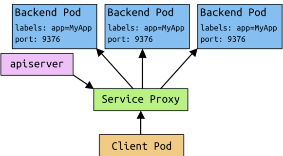
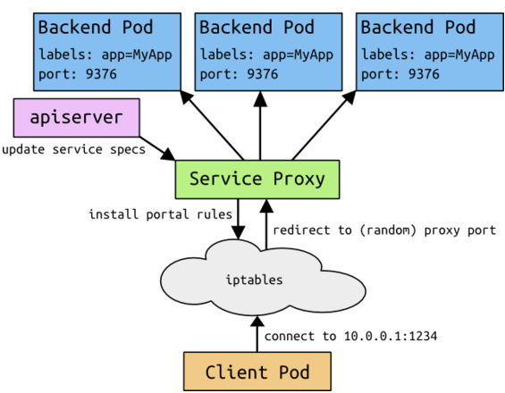

#概述

Kubernetes中 Pods 不是一成不变的。它们可以随着时间进行迁移，特别是当受到 ReplicationControllers 支配时。虽然每个pod都有属于自己的IP地址，但是却不能保证每个Pod的IP地址随着时间的变化依然保持不变。这就导致了一个问题：如果在Kubernetes集群里，有一系列的pods（我们姑且称之为后端）为其他的pods（称为前端）提供功能，那前端该如何去找到后端？

#服务

Kubernetes中的服务是一种抽象概念，它定义了一个pods逻辑集合以及访问它们的策略，有时它也被称为微服务（Micro-service）。服务的目标是提供一种桥梁，使得非Kubernetes原生应用程序，在无需为Kubernetes编写特定代码的前提下，轻松访问后端。服务会为用户提供一对IP地址和port端口，用于在访问时重定向到相应的后端。服务里Pods集合的选定是由一个标签选择器（label selector）来完成的。

举个例子，首先假设一个“镜像处理”后端，它运行着三个可用的副本。这些副本是无状态的，前端根本不关心自己具体使用的是后端的哪个副本。因此，尽管组成后端集合的实际pods可能已经发生了改变，但是前端用户完全不需要知晓这些改变。这种服务的抽象性实现了前端访问与后端服务的解耦。

#定义服务

这里是一个使用服务的例子。在Kubernetes中，服务是REST对象，类似于pod。如pod一般，服务的定义，可以通过一个发给apiserver的POST请求，来完成创建一个新的实例。例如，假设你有一组pods，都暴露9376端口，并携带一个"app=MyApp"的标签。

```json
{
  "id": "myapp",
  "selector": {
    "app": "MyApp"
  },
  "containerPort": 9376,
  "protocol": "TCP",
  "port": 8765
}
```

上述定义将创建一个名为"myapp"的新服务，它使得所有带有"app=MyApp"标签的pod都监听TCP协议上的端口9376。而客户可以通过端口$MYAPP_SERVICE_PORT连接到$MYAPP_SERVICE_HOST，从而访问该服务。

#服务是如何工作的？

在Kubernetes集群中的每个节点（node）上都运行着一个服务代理（service proxy）。该代理应用监听Kubernetes Master，以此来添加和删除服务对象及端点（endpoints，即满足服务标签选择器的pods），同时该代理应用还存储一个服务到端点列表的映射。它为每个服务在本地节点上打开一个端口，并转发该端口上的所有流量到后端。名义上是依据策略来执行的，但现在唯一支持的策略是轮转调度（round-robin）。

当一个pod被编入，Master为每一个存活的服务增加一组环境变量。我们支持 Docker-links-compatible 变量（参见makeLinkVariables）以及更简单的{SVCNAME}_SERVICE_HOST和{SVCNAME}_SERVICE_PORT变量，其中的服务名要求大写，破折号将转换为下划线。具体的服务工作图如图1 。例如，服务"redis-master"监听TCP端口637，并分配IP地址10.0.0.11，将产生以下环境变量：

```
REDIS_MASTER_SERVICE_HOST=10.0.0.11
REDIS_MASTER_SERVICE_PORT=6379
REDIS_MASTER_PORT=tcp://10.0.0.11:6379
REDIS_MASTER_PORT_6379_TCP=tcp://10.0.0.11:6379
REDIS_MASTER_PORT_6379_TCP_PROTO=tcp
REDIS_MASTER_PORT_6379_TCP_PORT=6379
REDIS_MASTER_PORT_6379_TCP_ADDR=10.0.0.11
```

这意味着要有先后次序，即一个pod希望访问的服务必须在pod本身创建之前被创建，否则环境变量不会被加载。不过支持DNS服务后，该限制将不再存在。

服务通过它的标签选择器，可以解析到0或多个端点。在服务的生命周期内，组成该服务的pods集合可以增加、缩减，或全部失效。用户只有在当他们正在使用的后端从服务中被移除时，才会遇到问题（即使如此，已经打开的连接也会因为某些协议的缘故，继续保持）。



图1.服务工作图

##细节明细

前文的内容对于大多数只是想要使用服务的人来说应该已经足够了。然而，有很多发生在这背后的事情也值得去深入了解。

##避免冲突

Kubernetes的一个主要理念是，用户不应该遭遇可能导致其操作失败的情景，尤其是用户本身并未引起错误。在此背景下，我们考虑网络端口的问题—不应该让用户选择一个可能与其他用户发生冲突的端口号。否则，将是隔离上的失败。

为了让用户能够选择他们的服务端口号，我们必须确保不会引起两个服务间的冲突。我们通过为每个服务分配自己的IP地址来做到这一点。

##IP和Portal

不同于路由到一个固定的pod的IP地址，服务的IP实际上并不是由单个Master响应的。相反的，我们用iptables（Linux中的数据包处理逻辑）来定义这些需要透明重定向的“虚拟”IP地址。我们将服务IP和服务端口的元组称为Portal。当用户连接到portal上，其访问会被自动转移到一个相应的端点上。实际上，服务的环境变量是依据portal的IP和端口来设定的。此外，我们将增加DNS来支撑服务的访问。

举例来说，考虑上图所展示的应用处理过程。在创建后端服务时，Kubernetes Master分配一个Portal的IP地址，例如10.0.0.1。假设服务端口是1234，portal即为是10.0.0.1:1234。Master将存储该信息，它也被集群中所有的服务代理实例所获取。当代理监测到一个新的portal，它会打开一个新的随机端口，建立一个从Portal到新端口的iptables重定向，然后开始接受对其的连接。

当用户使用portal端口连接MYAPP_SERVICE_HOST时（不论他们将其视为静态端口或视为MYAPP_SERVICE_PORT），iptables规则生效，重定向数据包到服务代理自身的端口上。服务代理选择一个后端，并开始从客户端到后端的代理通信流量。具体原理如图2。

最终的结果是，用户可以选择他们想要的任何服务端口，而没有冲突的危险。客户可以轻松连接IP和端口，而无需了解到他们正在访问哪个pods。



图2.服务中IP和portal原理图

#外部服务

对于用户应用程序的某些部分（如前端），用户希望在外部可访问的IP地址（公网IP）上暴露一个服务。

如果你希望你的服务暴露在一个公网IP地址上，你可以选择提供一个服务可以响应的"publicIPs"列表。这些IP地址将被绑定上服务端口，同时被映射到由服务选择的pods集合上。你随后需要负责确保到该公网IP地址的通信流量被发送到一个或多个kubernetes工作节点。与映射内部IP地址一致，每个主机上的每一条IPTables规则，将公网特定IP地址的数据包映射到内部的服务代理。

对于提供外部负载均衡设备的云服务提供商，还有一个更简单的方式来达到同样的效果。在这类供应商（如GCE）上，你可以让publicIPs为空，作为代替，你可以在服务上设置createExternalLoadBalancer标志。这会启动一个云服务提供商的特定负载均衡设备（假设它由你的云提供商支持），并用适当的值来填充这个公网IP值域。

#缺点

我们预计，portals使用的iptables将在小规模上可用，而无法扩展到有着成千上万服务的大型集群。查看 portals的原始设计方案 ，可了解更多详情。

#今后的工作

在将来，我们设想，代理策略可以变得比简单的轮循调度更加细致入微，比如master筛选或分片。我们还设想，一些服务将具有“真正的”负载均衡器，在这种情况下，portal将可以直接简单地传输数据包。
